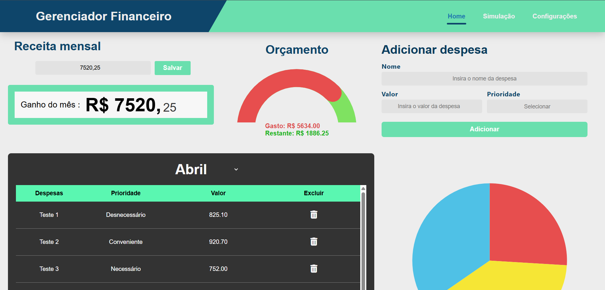

# Gerenciador Financeiro

Aplicação web desenvolvida com **Python**, **Flask**, **SQLite**, **HTML**, **CSS** e **JavaScript**, com foco em controle financeiro pessoal, visualização de despesas, simulação de economia e organização de gastos fixos recorrentes.

Além de atender a uma necessidade prática de organização financeira, este projeto foi construído para demonstrar competências importantes em **desenvolvimento web**, **persistência de dados**, **estruturação de aplicações back-end** e **integração entre front e back-end**, servindo como um passo importante no meu **crescimento no desenvolvimento de software**.



## 🌐 Acesse o Projeto Online

[Clique aqui para visualizar o projeto (Ctrl + clique para abrir em uma nova aba)](https://matheusmachado.pythonanywhere.com/)

O projeto está disponível online e pode ser acessado diretamente pelo navegador, sem necessidade de instalação local.

>[!CAUTION]
>**ATENÇÃO : Antes de acessar e utilizar o sistema, é importante ler a seção de "Observações de Uso" disponível ao final desta descrição.**

---

## 📚 Sobre o Projeto

O **Gerenciador Financeiro** foi desenvolvido como um projeto prático com o objetivo de transformar conceitos de programação e desenvolvimento web em uma aplicação real, utilizável e publicável. Mais do que apenas registrar despesas, a proposta do sistema foi reunir, em um único ambiente, funcionalidades que ajudassem a organizar a vida financeira de forma visual, simples e funcional.

Ele representa um passo importante na minha formação como desenvolvedor, especialmente nas áreas de:

- desenvolvimento web com Python
- back-end com Flask
- persistência de dados
- estruturação de software para deploy

---

## Principais Funcionalidades

- Cadastro e atualização da receita mensal
- Registro de despesas avulsas por mês
- Classificação de gastos por prioridade
- Visualização gráfica do orçamento e da distribuição dos gastos
- Simulação de economia com filtros e ocultação visual de despesas
- Gerenciamento de gastos fixos recorrentes com ativação e desativação individual

---

## ⚙️ Stack e Tecnologias

- **Python** — base da lógica do sistema, responsável pela manipulação dos dados financeiros.
- **Flask** — framework utilizado para estruturar as rotas, processar formulários, renderizar páginas e integrar front-end, back-end e banco de dados.
- **SQLite** — banco de dados utilizado para persistir receitas, despesas avulsas e gastos fixos recorrentes.
- **HTML, CSS e JavaScript** — conjunto responsável pela construção da interface, estilização visual da aplicação e interações dinâmicas do usuário com as tabelas, filtros e gráficos.
- **PythonAnywhere** — plataforma utilizada para realizar o deploy e disponibilizar a aplicação online.

---

## 💻 Arquitetura e Funcionamento

### Sessão Home

- Permite registrar a receita mensal correspondente ao mês selecionado.
- Permite adicionar despesas avulsas manualmente, informando nome, valor e prioridade.
- Consolida em tabela as despesas do mês, incluindo despesas comuns e gastos fixos ativos.
- Calcula automaticamente o total gasto no período.
- Exibe um indicador visual de orçamento consumido com base na relação entre receita e despesas.
- Gera a visualização gráfica da distribuição dos gastos por prioridade.

### Sessão Simulação

- Reaproveita as despesas do mês selecionado para análise sem modificar os dados reais.
- Permite ocultar visualmente itens da tabela para testar cenários alternativos de consumo.
- Oferece filtragem por prioridade e ordenação por preço.
- Recalcula em tempo real o total considerado na simulação.
- Compara o gasto original com a economia potencial por meio de barras visuais.

### Sessão Configurações

- Permite cadastrar gastos fixos recorrentes com nome, valor e prioridade.
- Exibe os gastos fixos em uma tabela própria, separada das despesas avulsas.
- Permite alternar individualmente entre gasto fixo ativo e inativo.
- Permite excluir gastos fixos cadastrados.
- Calcula quanto da renda mensal já está comprometido com gastos fixos ativos.
- Faz com que os gastos fixos ativos passem a integrar automaticamente os meses futuros a partir da data de início.

---

## 📁 Estrutura do Repositório

```plaintext
projeto-flask/
├── database/
│   └── .gitkeep
│
├── static/
│   ├── css/
│   │   ├── style.css
│   │   └── responsive.css
│   │
│   └── js/
│       ├── config.js
│       ├── graficos.js
│       └── simulacao.js
│
├── templates/
│   ├── base.html
│   ├── home.html
│   ├── simulacao.html
│   └── config.html
│
├── .gitignore
├── main.py
└── requirements.txt
````
---

## 📈 Evoluções Planejadas

- autenticação e login individual por usuário
- isolamento de dados por conta
- melhorias de responsividade para múltiplos dispositivos
- refinamento de UX/UI
- novas métricas e indicadores financeiros
- migração para banco de dados mais robusto em cenário multiusuário

---

## 📜 Observações de Uso

No estado atual, a aplicação está mais adequada apenas para **observação, demonstração e alterações simples**, especialmente em contexto de portfólio.

Como o sistema ainda **não possui autenticação e login individual por usuário**, qualquer alteração feita por uma pessoa pode impactar diretamente a experiência das demais, já que os dados persistidos ainda são compartilhados no mesmo banco da aplicação.

Além disso, no momento, o projeto foi desenvolvido com foco principal em **uso desktop**. A versão atual ainda **não possui responsividade completa para dispositivos móveis**, o que significa que futuras melhorias nessa área já estão previstas na evolução do sistema.
